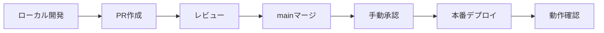

# Zendesk Guide デプロイガイド

## 🔐 GitHub Secrets設定（重要）

### 1. 必要なSecrets

以下の5つのSecretsをGitHubリポジトリに設定してください：

| Secret名 | 説明 | 取得方法 |
|---------|------|---------|
| `ZENDESK_SUBDOMAIN` | Zendeskサブドメイン | `https://YOUR_SUBDOMAIN.zendesk.com` の YOUR_SUBDOMAIN 部分 |
| `ZENDESK_EMAIL` | 管理者メールアドレス | Zendesk管理権限を持つユーザーのメールアドレス |
| `ZENDESK_API_TOKEN` | APIトークン | Zendesk管理画面 → アプリとインテグレーション → API で生成 |
| `ZENDESK_BRAND_ID` | ブランドID | URLから取得：`.../brands/{BRAND_ID}/...` |
| `ZENDESK_THEME_ID` | テーマID | ヘルプセンター → テーマ管理で現在のテーマIDを確認 |

### 2. Secrets設定手順

1. GitHubリポジトリページ → **Settings** タブ
2. 左メニュー → **Secrets and variables** → **Actions**
3. **New repository secret** をクリック
4. 上記5つのSecretsを順次追加

### 3. 権限確認チェックリスト

- [ ] ZENDESKメールアドレスは**管理者権限**を持っている
- [ ] APIトークンは**有効期限内**で正しく生成されている
- [ ] ブランドIDは**対象のヘルプセンター**のものである
- [ ] テーマIDは**現在のLiveテーマ**のものである

## ⚡ ワークフロー安全策の実装

### 本番環境保護設定

1. **Environment設定**
   - GitHubリポジトリ → Settings → Environments
   - `production` 環境を作成
   - **Required reviewers** を1名以上設定（推奨）

2. **手動実行モード（推奨）**
   - Actions → Deploy Help Center Theme
   - **Run workflow** で手動実行

### 安全なデプロイフロー



## 📋 本番前最終チェックリスト

### テクニカルチェック

- [ ] `zcli themes:validate` ローカルでグリーン
- [ ] すべてのアセット参照が `{{asset '...'}}` 形式
- [ ] `assets/style.css` と `assets/script.js` が直下に存在
- [ ] Popular検索タグ → 検索欄への値挿入が動作
- [ ] スクロール100pxでヘッダーが `nav--solid` クラス付与
- [ ] 画像に `loading="lazy"` 属性が適用
- [ ] ダークテーマのコントラスト比が適切

### 機能チェック

- [ ] ヒーローセクション表示
- [ ] 検索バー動作
- [ ] カテゴリカード6色表示
- [ ] ナビゲーション動作
- [ ] レスポンシブ（3→2→1列）

## 🚀 デプロイ実行手順

### Step 1: 事前準備

```bash
# 最終確認
cd ~/helpcenter-theme
git status
git log --oneline -5
```

### Step 2: GitHub Actionsでデプロイ

1. GitHubリポジトリページ → **Actions** タブ
2. **Deploy Help Center Theme** ワークフローを選択
3. **Run workflow** → **main** ブランチを選択
4. **Run workflow** をクリック

### Step 3: デプロイ監視

Actionsログで以下を確認：

- [ ] `validate` ジョブが成功
- [ ] `zcli themes:upload --version-bump patch` が成功
- [ ] Deployment record作成が成功

### Step 4: Zendesk側での公開

1. Zendesk管理画面 → **ヘルプセンター** → **テーマ**
2. 新しいバージョンが **Working copy** に表示されることを確認
3. **Set live** をクリックして公開

## 🔍 ポストデプロイ検証（5分スモークテスト）

### デスクトップ確認

- [ ] ヒーロー検索バーが中央に表示
- [ ] Popular searchesタグが表示＆クリック動作
- [ ] カテゴリカード6枚が正しい色で表示
- [ ] スクロールでナビゲーション変化
- [ ] 検索 → カテゴリ → 記事の導線（3操作以内）

### モバイル確認

- [ ] レスポンシブレイアウト（1列表示）
- [ ] タッチ操作が正常
- [ ] 文字サイズ・コントラストが適切

### パフォーマンス確認（目視）

- [ ] 初期読み込み：2.5秒以内
- [ ] レイアウトシフトなし
- [ ] 操作レスポンス：200ms以内

## 🔙 ロールバック手順

### 方法1: Zendesk管理画面から

1. ヘルプセンター → テーマ → **テーマを管理**
2. 前のバージョンを選択
3. **Set live** をクリック

### 方法2: GitHub Actionsで再デプロイ

```bash
# 前のコミットをmainにプッシュ
git revert HEAD
git push origin main
```

### 方法3: 手動アップロード

```bash
# バックアップから復元
zcli themes:upload --brand <BRAND_ID> --theme <THEME_ID> --path backups/theme-<timestamp>
```

## 📊 成功指標

### 即時確認項目

- [ ] サイト表示エラーなし
- [ ] 主要機能動作確認
- [ ] レスポンシブ表示正常

### 24時間後確認項目

- [ ] 検索利用率の変化
- [ ] カテゴリアクセス数
- [ ] ページ滞在時間

## ⚠️ macOS使用時の重要な注意事項

### 必須：拡張属性の除去

macOSでは以下の拡張属性が自動付与され、Zendeskアップロード時にエラーの原因となります：

- `com.apple.provenance`
- `com.apple.quarantine` 
- `com.apple.ResourceFork`

**対策**：
```bash
# 手動で拡張属性除去
npm run preupload

# または直接スクリプト実行
bash scripts/clean_macos_attrs.sh
```

### 禁止事項

❌ **Finder の「圧縮」メニューは使用禁止**
- `__MACOSX/` フォルダや `._ファイル` が生成されZendeskで弾かれます

❌ **直接 zcli themes:import 実行禁止**
- 必ず `npm run preupload` 実行後に行ってください

### 手動Zip作成（緊急時）

```bash
# 安全なZip作成（拡張メタ除去）
npm run build:zip

# または直接コマンド
COPYFILE_DISABLE=1 zip -X -r theme.zip . -x '*.DS_Store' -x '__MACOSX/*' -x '.git/*'
```

## 🚨 トラブルシューティング

### よくある問題

| 問題 | 原因 | 解決方法 |
|------|------|----------|
| script.js FileNotFound エラー | macOS拡張属性問題 | `npm run preupload` → 再アップロード |
| CSSが反映されない | キャッシュ問題 | ハードリロード（Ctrl+Shift+R） |
| JSエラー | 構文エラー | ブラウザDevToolsでエラー確認 |
| 画像が表示されない | パス問題 | `{{asset}}` ヘルパー確認 |
| 色が反映されない | CSS変数未定義 | `document_head.hbs` の `:root` 確認 |
| テンプレートファイル不足エラー | Copenhagen必須テンプレート不足 | 不要でもスタブテンプレートとして残す |

### 緊急連絡先

- **技術責任者**: [連絡先]
- **Zendesk管理者**: [連絡先]
- **エスカレーション**: [連絡先]

---

**作成日**: 2025年1月13日  
**対象環境**: 本番  
**承認者**: [記名]