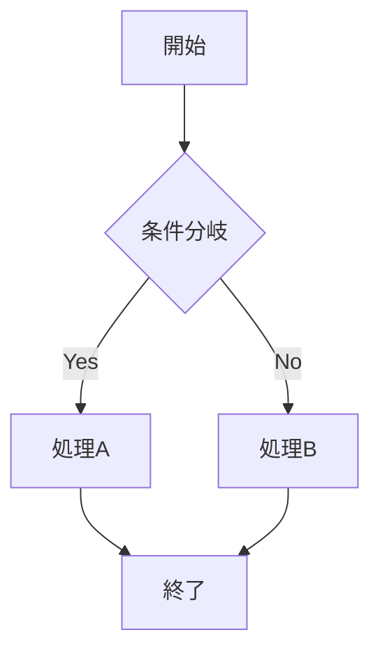
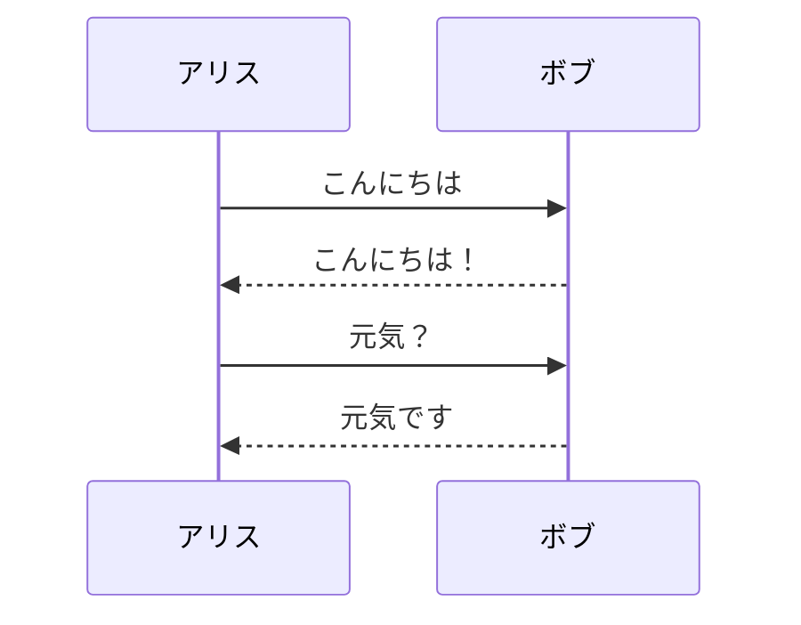

# プラグイン機能とエクステンション

Markdown Lite の機能を拡張するプラグインシステムの使い方と、利用可能な拡張機能を詳しく解説します。

## プラグインシステムの概要

### プラグインの種類
```markdown
利用可能な拡張機能:
📊 公式プラグイン - Markdown Lite チームが開発・保守
🛠️ コミュニティプラグイン - 開発コミュニティが作成
⚡ 内蔵機能拡張 - アプリに統合された追加機能
🔧 カスタムスクリプト - ユーザーが作成可能
```

### プラグインアーキテクチャ
```javascript
// プラグインの基本構造
class MarkdownLitePlugin {
  constructor() {
    this.name = 'プラグイン名';
    this.version = '1.0.0';
    this.description = 'プラグインの説明';
    this.author = '作成者';
  }

  // プラグイン有効化時に実行
  onActivate() {
    this.registerCommands();
    this.registerUI();
    this.bindEvents();
  }

  // プラグイン無効化時に実行
  onDeactivate() {
    this.cleanup();
  }
}
```

## 公式プラグイン

### Word Counter（文字数カウンター）
```markdown
機能:
✅ リアルタイム文字数表示
✅ 単語数・文字数・段落数のカウント
✅ 読了時間の推定
✅ 目標文字数の設定と進捗表示

使用方法:
1. 表示 → 文字数カウンター
2. ステータスバーに情報を表示
3. 設定でカウント方法をカスタマイズ
```

### Math Renderer（数式レンダリング）
```markdown
対応記法:
- インライン数式: $E = mc^2$
- ブロック数式:
$$
\int_{-\infty}^{\infty} e^{-x^2} dx = \sqrt{\pi}
$$

機能:
✅ LaTeX 記法の完全サポート
✅ リアルタイムレンダリング
✅ 数式エディターの統合
✅ 複雑な数式の入力支援

設定:
- MathJax または KaTeX エンジン選択
- レンダリング品質の調整
- フォントサイズとスタイル
```

### Mermaid Diagrams（図表作成）
````markdown
対応図表:
- フローチャート
- シーケンス図
- ガントチャート
- クラス図
- 状態図

使用例:



````

### Table Editor（表編集支援）
```markdown
機能:
🎯 表の視覚的編集
🎯 行・列の追加・削除
🎯 セルの結合・分割
🎯 データの並び替え
🎯 CSV インポート・エクスポート

ショートカット:
Tab           次のセルへ移動
Shift + Tab   前のセルへ移動
Cmd + →       列を追加
Cmd + ↓       行を追加
Cmd + Delete  行・列を削除
```

## コミュニティプラグイン

### Spell Checker Plus
```markdown
機能:
📝 高度なスペルチェック
📝 文法チェック
📝 専門用語辞書
📝 多言語対応

対応言語:
- 日本語（ひらがな、カタカナ、漢字）
- English（アメリカ・イギリス）
- Français、Deutsch、Español
- プログラミング用語
```

### Export Enhanced
```markdown
エクスポート形式:
📄 HTML（高度なカスタマイズ）
📄 PDF（レイアウト最適化）
📄 EPUB（電子書籍）
📄 Word（.docx）
📄 LaTeX
📄 Presentation（スライド）

カスタマイズオプション:
- CSS スタイルシート適用
- ヘッダー・フッターの設定
- ページ設定とマージン
- フォント選択と埋め込み
```

### Git Integration
```markdown
機能:
🔧 Git リポジトリとの統合
🔧 変更の可視化
🔧 コミット・プッシュの GUI
🔧 ブランチ管理
🔧 差分表示

Git 操作:
- ファイル状態の確認
- 変更内容のステージング
- コミットメッセージの作成
- リモートリポジトリとの同期
```

### Reading Time Estimator
```javascript
// 読了時間推定の設定例
{
  "readingTime": {
    "wordsPerMinute": 200,        // 日本語の場合
    "includeCodeBlocks": false,   // コードブロックを除外
    "includeImages": true,        // 画像閲覧時間を含む
    "imageViewTime": 12,          // 画像1枚あたり12秒
    "showInStatusBar": true       // ステータスバーに表示
  }
}
```

## プラグインの管理

### インストール方法
```markdown
インストール手順:
1. 環境設定 → プラグイン → マーケットプレース
2. 目的のプラグインを検索
3. 「インストール」ボタンをクリック
4. アプリケーションを再起動

手動インストール:
1. プラグインファイル（.mdlplugin）をダウンロード
2. ファイル → プラグインをインストール
3. プラグインファイルを選択
4. 再起動後に有効化
```

### プラグインの設定
```json
{
  "plugins": {
    "wordCounter": {
      "enabled": true,
      "showInStatusBar": true,
      "countMethod": "characters",
      "excludeCodeBlocks": false
    },
    "mathRenderer": {
      "enabled": true,
      "engine": "MathJax",
      "fontSize": "normal",
      "macros": {}
    },
    "spellChecker": {
      "enabled": true,
      "language": "ja-JP",
      "checkAsYouType": true,
      "suggestionsLimit": 5
    }
  }
}
```

### 無効化・削除
```markdown
無効化:
1. 環境設定 → プラグイン → インストール済み
2. 対象プラグインのスイッチをオフ
3. 「適用」をクリック

削除:
1. プラグインを無効化
2. 「削除」ボタンをクリック
3. 確認ダイアログで「削除」を選択
4. 関連ファイルも削除（オプション）
```

## カスタムプラグインの作成

### 開発環境の準備
```bash
# プラグイン開発キットのインストール
npm install -g markdown-lite-plugin-cli

# 新しいプラグインプロジェクトの作成
mdl-plugin create my-awesome-plugin
cd my-awesome-plugin

# 開発サーバーの起動
npm run dev
```

### 基本的なプラグイン例
```javascript
// plugins/word-highlight/index.js
class WordHighlightPlugin {
  constructor() {
    this.name = 'Word Highlight';
    this.version = '1.0.0';
    this.description = '特定の単語をハイライト表示';
  }

  onActivate() {
    // コマンドの登録
    this.registerCommand('highlight-word', this.highlightSelectedWord.bind(this));
    
    // UI の追加
    this.addToolbarButton();
    
    // イベントリスナーの設定
    document.addEventListener('selectionchange', this.onSelectionChange.bind(this));
  }

  highlightSelectedWord() {
    const selection = window.getSelection();
    const selectedText = selection.toString().trim();
    
    if (selectedText) {
      this.addHighlight(selectedText);
    }
  }

  addHighlight(word) {
    const editor = document.querySelector('.editor');
    const content = editor.value;
    const regex = new RegExp(`\\b${word}\\b`, 'gi');
    
    const highlightedContent = content.replace(regex, `<mark>$&</mark>`);
    
    // プレビューに反映
    this.updatePreview(highlightedContent);
  }

  addToolbarButton() {
    const toolbar = document.querySelector('.toolbar');
    const button = document.createElement('button');
    button.innerHTML = '🖍️ ハイライト';
    button.onclick = () => this.highlightSelectedWord();
    toolbar.appendChild(button);
  }

  onDeactivate() {
    // クリーンアップ処理
    document.removeEventListener('selectionchange', this.onSelectionChange);
    const button = document.querySelector('.toolbar button[data-plugin="word-highlight"]');
    if (button) button.remove();
  }
}

// プラグインの登録
window.registerPlugin(new WordHighlightPlugin());
```

### プラグイン設定ファイル
```json
{
  "manifest": {
    "name": "Word Highlight",
    "version": "1.0.0",
    "description": "特定の単語をハイライト表示するプラグイン",
    "author": "Your Name",
    "homepage": "https://github.com/username/word-highlight-plugin",
    "main": "index.js",
    "permissions": [
      "editor.read",
      "editor.write", 
      "preview.update"
    ],
    "engines": {
      "markdown-lite": ">=0.4.0"
    }
  },
  "settings": {
    "highlightColor": {
      "type": "color",
      "default": "#ffff00",
      "title": "ハイライト色"
    },
    "caseSensitive": {
      "type": "boolean", 
      "default": false,
      "title": "大文字小文字を区別"
    }
  }
}
```

## API リファレンス

### 利用可能な API
```javascript
// エディター API
const EditorAPI = {
  // テキスト操作
  getText: () => string,
  setText: (text: string) => void,
  getSelectedText: () => string,
  replaceSelection: (text: string) => void,
  insertText: (text: string, position?: number) => void,
  
  // カーソル操作
  getCursorPosition: () => number,
  setCursorPosition: (position: number) => void,
  getSelection: () => {start: number, end: number},
  setSelection: (start: number, end: number) => void,
  
  // ファイル操作
  getCurrentFile: () => FileInfo,
  saveFile: (path?: string) => Promise<boolean>,
  openFile: (path: string) => Promise<boolean>
};

// プレビュー API
const PreviewAPI = {
  getHTML: () => string,
  setHTML: (html: string) => void,
  scrollTo: (position: number) => void,
  refresh: () => void,
  getScrollPosition: () => number
};

// UI API
const UIAPI = {
  // 通知
  showNotification: (message: string, type?: 'info'|'warning'|'error') => void,
  showDialog: (options: DialogOptions) => Promise<any>,
  
  // メニュー
  addMenuItem: (label: string, callback: Function, submenu?: string) => void,
  removeMenuItem: (id: string) => void,
  
  // ツールバー
  addToolbarButton: (options: ButtonOptions) => void,
  removeToolbarButton: (id: string) => void
};
```

### イベントシステム
```javascript
// イベントリスナーの登録
PluginAPI.on('file.opened', (fileInfo) => {
  console.log(`ファイルが開かれました: ${fileInfo.path}`);
});

PluginAPI.on('text.changed', (changes) => {
  console.log('テキストが変更されました:', changes);
});

PluginAPI.on('preview.updated', (html) => {
  console.log('プレビューが更新されました');
});

// カスタムイベントの発行
PluginAPI.emit('custom.event', {data: 'custom data'});
```

## プラグインのテストとデバッグ

### テスト環境の構築
```javascript
// test/word-highlight.test.js
describe('WordHighlightPlugin', () => {
  let plugin;
  
  beforeEach(() => {
    plugin = new WordHighlightPlugin();
    plugin.onActivate();
  });
  
  afterEach(() => {
    plugin.onDeactivate();
  });
  
  it('選択されたテキストをハイライトできる', () => {
    // テストの実装
    const testText = 'Hello World';
    document.getSelection().selectAllChildren(/* test element */);
    
    plugin.highlightSelectedWord();
    
    const highlighted = document.querySelector('mark');
    expect(highlighted).toBeTruthy();
    expect(highlighted.textContent).toBe(testText);
  });
});
```

### デバッグ手法
```javascript
// デバッグ用ロギング
class DebugLogger {
  static log(message, data = null) {
    if (process.env.NODE_ENV === 'development') {
      console.log(`[Plugin Debug] ${message}`, data);
    }
  }
  
  static error(message, error = null) {
    console.error(`[Plugin Error] ${message}`, error);
  }
}

// プラグイン内でのデバッグ
DebugLogger.log('プラグイン有効化', this.name);
DebugLogger.log('選択テキスト', selectedText);
```

## プラグインの配布

### パッケージング
```bash
# プラグインをパッケージ
npm run build

# .mdlplugin ファイルの作成
npm run package

# 署名（公開プラグインの場合）
npm run sign --key=private_key.pem
```

### プラグインマーケットプレース
```markdown
公開手順:
1. GitHub リポジトリで開発
2. テストとドキュメント作成
3. プラグインマーケットプレースに申請
4. レビューと承認
5. 公開とバージョン管理

要求事項:
- セキュリティ審査の通過
- 品質基準の満足
- ドキュメントの完備
- テストカバレッジ80%以上
```

---

**関連記事**
- [カスタマイズ設定](customization.md)
- [ソースからのビルド方法](build-from-source.md)
- [技術的な質問](../faq/technical-questions.md)